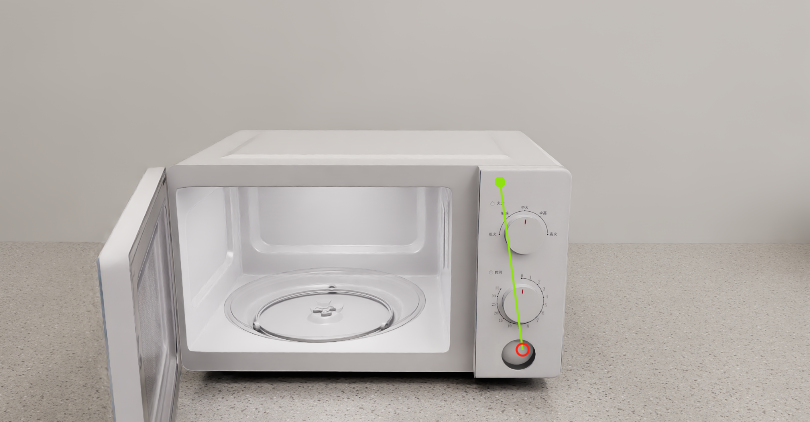

# ArtVIP: Articulated Digital Assets of Visual Realism, Modular Interaction, and Physical Fidelity for Robot Learning

[](https://opensource.org/licenses/Apache-2.0)
[](https://x-humanoid-artvip.github.io/)
[](https://arxiv.org/abs/2506.04941)
[](https://huggingface.co/datasets/x-humanoid-robomind/ArtVIP)

## Key Features

✅ We release a collection of 26 categories, **206 high-quality digital-twin articulated objects**.

✅ We provide digital-twin scene assets and configured scenarios integrating articulated objects within scene for immediate use.

✅ All assets are provided in **USD format** and are **open-source**.

✅ The detailed production process and standard offer comprehensive guidance to facilitate community adoption and replication.


---

### Dataset Structure

1. **Articulated objects**

| Articulated objects              | Items                                                                 |
|-----------------------|-----------------------------------------------------------------------|
| Household Items    | basket, cardboard_box, mop, pump_bottle, stationery, tongs, toolbox, trash_can |
| Large Furniture    | cupboard, wardrobe                                                   |
| Major Appliances   | built-in_oven, dishwasher, refrigerator, standing_fan, toilet, washing_machine, water_dispenser |
| Small Appliances   | coffee_machine, laptop, microwave, oven, rice_cooker, table_fan, water_dispenser |
| Small Furniture    | cabinet, chair, faucet, filing_cabinet, shoe_cabinet, table          |


2. **Scenes**

| Scene Type          | Included Scenes                                                                 |
|---------------------|---------------------------------------------------------------------------------|
| Children's Room     | 🏠 `children_room`                                                              |
| Dining Room         | 🍽️ `dining_room`                                                                |
| Kitchen             | 🔪 `kitchen`                                                                    |
| Kitchen with Parlor | 🛋️ `kitchen_with_parlor`                                                        |
| Large Living Room   | 🖼️ `large_living_room`                                                          |
| Small Living Room   | 📺 `small_living_room`                                                          |

3. **Interactive Scenes**

| Scene Type     | Interactive Scenes                              |
|---------------------|-------------------------------------------------|
| Children's Room     | 🎮 `children_room`                               |
| Kitchen             | 🔪 `kitchen`


---


## Dataset information

### Description

ArtVIP, a com-prehensive open-source dataset comprising high-quality digital-twin articulated objects, accompanied by indoor-scene assets. Crafted by professional 3D modelers adhering to unified standards, ArtVIP ensures visual realism through precise ge-ometric meshes and high-resolution textures, while physical fidelity is achieved via fine-tuned dynamic parameters. Meanwhile, the dataset pioneers embedded modular interaction behaviors within assets and pixel-level affordance annotations. Feature-map visualization and optical motion capture are employed to quantitatively demonstrate ArtVIP’s visual and physical fidelity, with its applicability validated across imitation learning and reinforcement learning experiments. Provided in USD format with detailed production guidelines, ArtVIP is fully open-source, benefiting the research community and advancing robot learning research.

### How to use
1. **Install Isaac Sim 4.5**
    - Official Documentation: [https://docs.isaacsim.omniverse.nvidia.com/latest/installation/download.html](https://docs.isaacsim.omniverse.nvidia.com/latest/installation/download.html)

    - Linux Version Download: [https://download.isaacsim.omniverse.nvidia.com/isaac-sim-standalone%404.5.0-rc.36%2Brelease.19112.f59b3005.gl.linux-x86_64.release.zip](https://download.isaacsim.omniverse.nvidia.com/isaac-sim-standalone%404.5.0-rc.36%2Brelease.19112.f59b3005.gl.linux-x86_64.release.zip)

    - Installation steps:
   ```bash
   # Create installation directory
   mkdir ~/isaacsim
   
   # Unzip package (assuming downloaded to ~/Downloads)
   cd ~/Downloads
   unzip "isaac-sim-standalone@4.5.0-rc.36+release.19112.f59b3005.gl.linux-x86_64.release.zip" -d ~/isaacsim
   
   # Run post-installation setup
   cd ~/isaacsim
   ./post_install.sh
   
   # Launch Isaac Sim
   ./isaac-sim.sh
### Examples

**Kitchen Scene Interaction Demo**:
1. Locate the scene file: `Interactive_scene/kitchen/Kitchen.usd`
2. Open in Isaac Sim and click ▶️ PLAY
3. **Force Application**:
    - Hold `SHIFT + Left Click` and drag to apply external forces (highlighted in green in the demonstration image)


